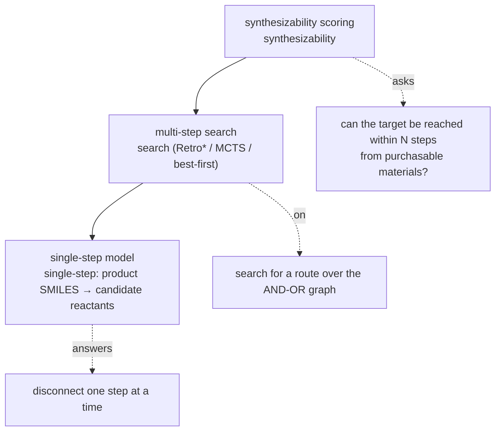

# SynOmega

**SynOmega covers a range of prediction capabilities for organic small-molecule reactions**, including single-step forward reaction prediction, single-step retrosynthesis, multi-step route planning, and synthesizability scoring.

## Why three layers

The core of SynOmega is three **decoupled** layers, each committing to a single narrow interface, so that each can be replaced and evaluated on its own:

The layers connect only through a deliberately narrowed interface — a single-step backend only needs to implement
`predict(smiles, top_k) -> [Prediction]` — so the planner and the scorer **do not care** whether the candidates come from a graph neural network, a Transformer, or pure template matching.

The single-step retrosynthesis, multi-step search, and synthesizability scoring above form the backbone of SynOmega; the other two capabilities share the same reaction templates and graph models:

- **Single-step forward reaction prediction (forward)**: reactants → product, the "mirror image" of the retrosynthetic single-step model, reusing the same reaction template library.
- **Reaction plausibility scoring (plausibility)**: assigns a reaction a score for "how chemically plausible it is".

## Technology stack at a glance

| Capability | Method core |
|---|---|
| Single-step retrosynthesis | D-MPNN neural template classifier (can also fall back to a pure template-rule backend, no torch required) |
| Single-step forward prediction | Mirror of the same D-MPNN template classifier + RDKit forward template application |
| Multi-step route planning | Retro\* by default, also includes MCTS and best-first, all searching over the AND-OR graph |
| Synthesizability scoring | Continuous SynScore based on the "number of non-purchasable starting materials" in the optimal route |
| Reaction plausibility | Dual-tower D-MPNN, no atom mapping, comparing the reactant graph vs the product graph |
| Molecular identity | InChIKey used uniformly throughout (consistent deduplication, stock lookup, and caching across tools) |

## Documentation guide

- **[Feature Guide](guide.md)** — one section per feature, covering installation and command-line / Python-API usage (matching the research-report chapters one-to-one).
- **[Research Report](research/index.md)** — chapter-by-chapter model/algorithm architecture, pseudocode, training sets, evaluation metrics, and figures for each capability module. The evaluation protocol, terminology, and data conventions are defined centrally in that chapter's [Overview](research/index.md) and referenced by each capability chapter.

!!! note "On the training-data conventions"
    All models described here are trained on a **large-scale atom-mapped commercial
    reaction corpus**. The raw reactions are not distributed with the software; what is
    released publicly are the **trained model weights**. See the [Overview](research/index.md) for the
    sampling conventions of each evaluation set (the ZINC purchasable building-block set, the ChEMBL target set).
