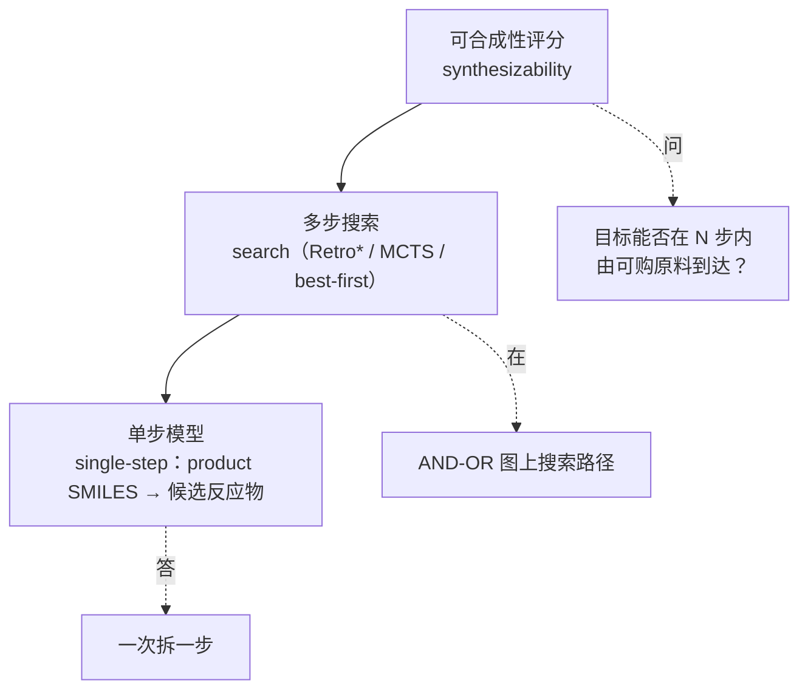

# SynOmega

**SynOmega 是一套逆合成（retrosynthesis）与可合成性（synthesizability）预测软件包**：给定一个目标分子，它给出从可购原料出发的合成路径，并输出一个连续的**可合成性评分 SynScore**。它把"这个分子好不好合成"从一句主观判断，变成一个可复现、可排序、带路径依据的数值。

## 一句话定位

> 输入一个 SMILES，输出：它能否在 N 步内由可购原料合成、最优路径长什么样、以及一个 0–1 的可合成性分数。

## 为什么分三层

SynOmega 的核心是三个**解耦**的层，每层只认一个很窄的接口，因此可以各自替换、各自评测：

层与层之间只通过一个刻意收窄的接口相接——单步后端只需实现
`predict(smiles, top_k) -> [Prediction]`——所以规划器（planner）和评分器
（scorer）**不关心**候选到底来自图神经网络、Transformer 还是纯模板匹配。

围绕这三层，SynOmega 还提供两个独立能力：

- **单步正向反应预测（forward）**：反应物 → 产物，是逆合成单步模型的"镜像"，复用同一套反应模板库。
- **反应合理性评分（plausibility）**：给一个反应打一个"它在化学上合不合理"的分数。

## 技术栈一览

| 能力 | 方法内核 |
|---|---|
| 单步逆合成 | D-MPNN 神经模板分类器（也可退化为纯模板规则后端，无需 torch） |
| 单步正向预测 | 同一 D-MPNN 模板分类器的镜像 + RDKit 模板正向应用 |
| 多步路径规划 | Retro\* 为默认，另含 MCTS、best-first，均在 AND-OR 图上搜索 |
| 可合成性评分 | 基于最优路径中"不可购起始物数量"的连续 SynScore |
| 反应合理性 | 双塔（dual-tower）D-MPNN，无原子映射，反应物图 vs 产物图对比 |
| 分子身份 | 全流程统一用 InChIKey（去重、库存判定、缓存跨工具一致） |

## 文档导航

- **[主要功能](features.md)** —— 安装、命令行 / Python API、能力清单与快速上手。
- **[研究报告](research/index.md)** —— 按功能模块逐章给出模型/算法架构、伪代码、训练集、评测指标与配图。评测协议、术语与数据口径集中在该章的[总览](research/index.md)里定义，各功能章引用。

!!! note "关于训练数据的口径"
    文中所有模型均训练于一份**大规模原子映射反应语料**（atom-mapped commercial
    reaction corpus）。原始反应不随软件分发；对外发布的是**训练好的模型权重**。各评测
    集（ZINC 可购砌块集、ChEMBL 靶集）的抽样口径见[总览](research/index.md)。
