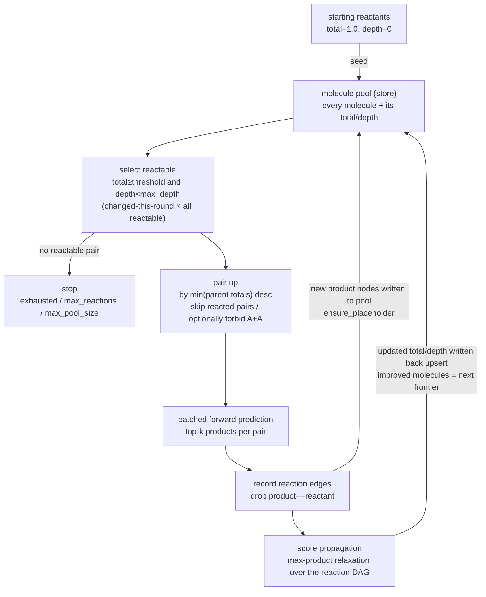

# Multi-component Evolution

**Task**: starting from a set of reactant molecules, repeatedly use the forward
model to pick two molecules from a growing "pool", react them, and add the
products back — **growing a forward synthesis network**. It answers: reacting
these starting materials two at a time over many rounds, which molecules can
emerge, along which route, and with what confidence?

It is built on top of [single-step forward prediction](forward.md): the forward
model only answers "two molecules → product"; multi-component evolution (MCE)
places that single step inside a **generational best-first** loop, organises the
results into a network, and assigns every molecule a propagatable confidence
score.

## 1. Score and depth semantics

Each molecule carries two quantities (exactly as specified):

| Quantity | Starting reactant | Product |
|---|---|---|
| **step score** | — | forward-prediction probability of that product |
| **total score** | `1.0` | `min(the two reactants' totals) × step score` |
| **synthesis depth** | `0` | `max(the two reactants' depths) + 1` (depth of the synthesis **tree**, **not** step count) |

- The total is a "weakest-link" product: a route's confidence is capped by both
  its least-confident step and its least-confident starting material.
- Depth is the height of the synthesis tree: when two parallel sub-routes merge
  into one product, take the deeper one +1 rather than summing step counts.

## 2. Algorithm



The **pool is the central store**: each round selects reactable molecules from it
(read), then writes **new product nodes** into it and writes back the **updated
totals/depths** from propagation (two writes), and the next round selects from the
grown pool — so the pool updates every generation rather than being filled once and
left static.

**Generational**: each round pairs only "molecules whose score changed this
round" × "all reactable molecules", avoiding re-enumeration of the whole pool;
pairs are ordered by `min(parent totals)` descending — the upper bound on the
product's total — so the **highest-potential pairs react first**.

**Score propagation (the key design)**: a reactant may, several rounds later, be
found to have a higher-scoring route, raising its total. Without propagation, a
product made from it earlier would remain under-scored — even wrongly pruned
below the threshold. So after each batch of new edges, a **max-product
relaxation** runs over the reaction network:

> a molecule's total = max over its incoming edges of `min(parent totals) × step`;
> depth follows the best edge; starting reactants are pinned at (1.0, 0).
> Improvements propagate to dependents until a fixpoint.

This recomputes only over **recorded edges** — no extra model calls, so it is
cheap. All reaction edges are kept, so the result is a genuine **network** (a
molecule may have several incoming edges), not one best route per molecule.

!!! note "Depth may exceed max_depth"
    `max_depth` only gates whether a molecule may **keep** acting as a reactant.
    To preserve a higher-scoring route, propagation may push a molecule's recorded
    depth above `max_depth` — this is the intended "score-first" behaviour, not a
    bug.

## 3. Pseudocode

```text
function evolve(reactants, max_depth, score_threshold, forward_top_k):
    pool = { canonical(r): (total=1.0, depth=0)  for r in reactants }
    reacted_pairs = {}                              # dedup already-reacted pairs
    changed = set(pool)
    loop:
        reactable = [ m in pool if m.total >= score_threshold and m.depth < max_depth ]
        pairs = new_pairs(changed ∩ reactable, reactable)   # >=1 endpoint changed this round, not yet reacted
        if pairs is empty: break                    # stop: no reactable pair
        sort pairs by  -min(total[a], total[b])     # highest-potential first

        for batch in chunks(pairs):                 # batched into the forward model
            for (a, b), preds in forward_batch(batch, top_k=forward_top_k):
                for pred in preds:
                    prod = canonical(pred.product)
                    if prod in (a, b): continue
                    add_edge(prod, a, b, step=pred.score, template=pred.template_id)

        changed = relax(pool, new_products)         # max-product relaxation; returns improved molecules
    return network(pool, edges)

function relax(pool, seeds):                         # propagate over the reaction DAG, no model calls
    queue = seeds
    while queue:
        m = pop(queue)
        best = max over incoming(m) of  min(total[a], total[b]) * step        # sources pinned at (1.0,0)
        if best improves m.total (or same score, shallower):
            update m; enqueue dependents(m)
    return { m : became/stayed reactable and improved this round }
```

## 4. Two run modes

The same algorithm runs against one storage interface (`EvolutionStore`); the two
backends are **bit-for-bit identical** in result and differ only in where data
lives:

| Mode | Storage | For |
|---|---|---|
| `memory` (InMemory) | pool / edges / reacted-pairs all in RAM | a handful of starting reactants |
| `disk` (InDisk) | everything in a SQLite DB under `work_dir`; frontier queries and relaxation are indexed | many starting reactants whose intermediates do not fit in RAM |
| `auto` | switches to disk when the number of sources exceeds a threshold | when the scale is unknown |

At scale the real bottleneck is the O(n²) pairwise pairing: `disk` fixes
**storage**, and `frontier_width` (pair only the top-N highest-scoring molecules
per round) fixes **fan-out**. `disk` mode wipes the DB at the start of every
`evolve`, guaranteeing identity with the in-memory backend and no contamination
from a previous run.

## 5. End-to-end example: the three-component Mannich reaction

Validated end-to-end on the classic three-component **Mannich** starting
materials (server `template-gnn` env, r20 forward model):

- Starting materials: acetophenone `CC(=O)c1ccccc1` + formaldehyde `C=O` +
  dimethylamine `CNC`.
- The evolution reaches (at depth 2) the classic **Mannich base**
  `CN(C)CCC(=O)c1ccccc1`, via a route consistent with the textbook mechanism:
  **first** an aldol condensation of acetophenone and formaldehyde to the vinyl
  ketone (enone) `C=CC(=O)c1ccccc1`, **then** an aza-Michael addition of
  dimethylamine onto the enone.

So the model does not "get it in one lucky step": it decomposes the
three-component reaction into two steps through the correct intermediate — and
that α,β-unsaturated ketone intermediate is indeed observed in real Mannich
systems.

```bash
synomega evolve --reactants "CC(=O)c1ccccc1.C=O.CNC" \
                --max-depth 3 --score-threshold 0.01 --forward-top-k 5
```

## 6. Limitations and positioning

- MCE is a **search / evolution process**, not a classifier — it has no top-k
  accuracy metric; its confidence comes entirely from the underlying forward
  model's probabilities multiplied in a weakest-link fashion. The forward model's
  [structural ceiling](forward.en.md) (template-based, product top-1 ≈ 0.64)
  propagates upward.
- Cost grows as O(n²) in the number of sources; at scale, always cap fan-out and
  storage with `frontier_width` and `disk` mode.
- The score is a relative ordering of route **confidence**, not yield or
  thermodynamic feasibility; it does not replace judgement about conditions,
  selectivity, or yield.
