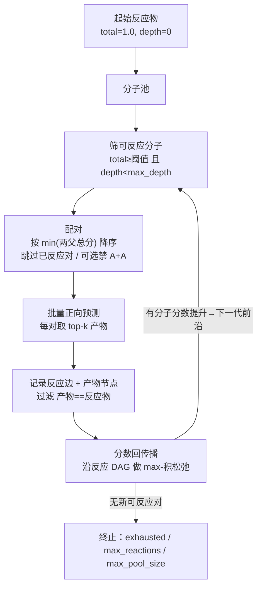

# 多组分演化预测

**任务**：给定一组起始反应物，反复用正向预测模型从"分子池"里挑两个分子反应、把产物加回池中，
**长出一张正向合成网络**——回答"这些原料两两、多轮反应，能演化出哪些分子、经由哪条路线、可信度多高"。

它建立在[单步正向反应预测](forward.md)之上：正向模型只回答"两个分子 → 产物"，
多组分演化（Multi-Component Evolution, MCE）把这一步放进一个**分代最佳优先**的迭代里，
自动组织成网络，并给每个分子算出一个可传播的可信度分数。

## 1. 分数与深度的语义

每个分子带两个量（完全照给定语义）：

| 量 | 起始反应物 | 产物 |
|---|---|---|
| **单步合成分数** step_score | —— | 该产物的正向预测概率 |
| **总合成分数** total_score | `1.0` | `min(两个反应物的总分) × 单步分数` |
| **合成深度** depth | `0` | `max(两个反应物的深度) + 1`（合成**树**的深度，**不是**步数） |

- 总分是一条"最弱环节"式的乘积：一条路线的可信度不超过其中最不可信的一步，也不超过最不可信的原料。
- 深度是合成树的高度：两条并行子路汇合成一个产物时，取更深的那条 +1，而非把步数相加。

## 2. 算法架构



**分代（generational）**：每一代只对"本代分数有变化的可反应分子"× "全部可反应分子"配对，
避免重复枚举整池；配对按 `min(两父总分)` 降序——这是产物总分的上界，因此**最有潜力的对先反应**。

**分数回传播（关键设计）**：某个反应物在后面几代可能被发现一条更高分的合成路线，
它的总分因此上调。若不回传，早先由它做出的产物就会停留在被低估的分数上、甚至被错误地剪到阈值以下。
所以每记录一批新反应边后，沿反应网络做一次 **max-积松弛**（max-product relaxation）：

> 分子总分 = 所有入边中 `min(两父总分) × 单步分` 的最大值；深度随最优边走；起始物钉死在 (1.0, 0)。
> 提升沿"依赖它的产物"逐层扩散到不动点。

这只是在**已记录的边**上重算，不再调用模型，代价低。所有反应边都保留，所以结果是一张真正的**网络**
（一个分子可有多条入边），而非每个分子只留一条最优路线。

!!! note "深度可能超过 max_depth"
    `max_depth` 只作为"该分子能否**继续**作反应物"的闸门。回传播为保留一条更高分的路线，
    可能把某分子的记录深度抬到 `> max_depth`——这是"分数优先"的预期行为，不是 bug。

## 3. 伪代码

```text
function evolve(reactants, max_depth, score_threshold, forward_top_k):
    pool = { canonical(r): (total=1.0, depth=0)  for r in reactants }
    reacted_pairs = {}                              # 已反应对，避免重复
    changed = set(pool)
    loop:
        reactable = [ m in pool if m.total >= score_threshold and m.depth < max_depth ]
        pairs = new_pairs(changed ∩ reactable, reactable)   # 至少一端本代有变化、且未反应过
        if pairs is empty: break                    # 终止：无可反应对
        sort pairs by  -min(total[a], total[b])     # 高潜力优先

        for batch in chunks(pairs):                 # 批量喂给正向模型
            for (a, b), preds in forward_batch(batch, top_k=forward_top_k):
                for pred in preds:
                    prod = canonical(pred.product)
                    if prod in (a, b): continue
                    add_edge(prod, a, b, step=pred.score, template=pred.template_id)

        changed = relax(pool, new_products)         # max-积松弛，返回分数提升的分子
    return network(pool, edges)

function relax(pool, seeds):                         # 沿反应 DAG 传播，不调模型
    queue = seeds
    while queue:
        m = pop(queue)
        best = max over incoming(m) of  min(total[a], total[b]) * step        # 起始物钉死 (1.0,0)
        if best improves m.total (或同分更浅):
            update m; enqueue dependents(m)
    return { m : m 变得/仍然可反应且本轮有提升 }
```

## 4. 两种运行模式

同一套算法跑在一个存储接口（`EvolutionStore`）之上，两种后端**结果逐位一致**，只差数据放在哪：

| 模式 | 存储 | 适用 |
|---|---|---|
| `memory`（InMemory） | 分子池 / 反应边 / 已反应对全在内存 | 少量起始反应物 |
| `disk`（InDisk） | 全部落到 `work_dir` 下的 SQLite 库，前沿查询与松弛都走索引 | 大量起始反应物，中间分子放不下内存 |
| `auto` | 起始物数 > 阈值自动转 disk | 不确定规模时 |

大规模的真正瓶颈是 O(n²) 的两两配对：`disk` 解决**存储**，`frontier_width`（每代只配对分数最高的前 N 个分子）
解决**扇出**。`disk` 模式每次 `evolve` 都清空库重来，保证与内存后端一致、不被上一轮残留污染。

## 5. 端到端示例：三组分 Mannich 反应

用经典的三组分 **Mannich 反应**起始原料做端到端验证（服务器 `template-gnn` 环境、r20 正向模型）：

- 起始物：苯乙酮 `CC(=O)c1ccccc1` + 甲醛 `C=O` + 二甲胺 `CNC`
- 演化结果（depth 2）命中经典 **Mannich 碱** `CN(C)CCC(=O)c1ccccc1`，
  且给出的路线与教科书机理一致：**先**苯乙酮与甲醛羟醛缩合脱水成苯乙烯基酮（烯酮）
  `C=CC(=O)c1ccccc1`，**再**二甲胺对烯酮做 aza-Michael 加成。

也就是说，模型不是"一步蒙对"，而是自己把三组分反应拆成两步、经由正确的中间体演化到目标产物——
这类中间体（α,β-不饱和酮）在真实 Mannich 体系中确有观测。

```bash
synomega evolve --reactants "CC(=O)c1ccccc1.C=O.CNC" \
                --max-depth 3 --score-threshold 0.01 --forward-top-k 5
```

## 6. 局限与定位

- MCE 是一个**演化 / 搜索过程**，不是分类器——它没有 top-k 精度这类指标，其可信度完全来自底层正向模型的
  概率经"最弱环节"式相乘传播；正向模型的[结构性上限](forward.md)（模板法、产物 top-1 ≈ 0.64）会向上传导。
- 计算量随起始物数呈 O(n²) 增长；大规模务必配 `frontier_width` 与 `disk` 模式封顶扇出与存储。
- 分数是路线**可信度**的相对排序，不是产率或热力学可行性；它不替代反应条件、选择性与产率的判断。
