# Single-step Forward Reaction Prediction

**Task**: given a set of reactants, predict the most likely product and rank the candidates.

SynOmega's forward prediction is a **mirror** of the retrosynthesis single-step model: it
reuses the same 64,366 reaction templates and the same D-MPNN template classifier, and
only at the application stage does it **reverse** the retrosynthesis template and apply it
forward to the reactants with RDKit. It is template-based, interpretable, and shares its
template library with retrosynthesis; it does not aim for SOTA end-to-end accuracy.

## 1. Model / algorithm architecture

```mermaid
flowchart LR
    R["Reactant SMILES<br/>A.B (multiple molecules)"] --> G["Graph featurization<br/>keep all fragments + Gasteiger"]
    G --> M["D-MPNN encoder"]
    M --> S["softmax over 64,366 templates"]
    S --> T["top-k forward templates"]
    T --> INV["Template inversion<br/>retro >> → forward >>"]
    INV --> A["RDKit RunReactants<br/>fragment permutation fills template slots"]
    A --> F["Sanitize + radical filtering<br/>take largest organic fragment"]
    F --> D["Rank products by (max template probability, number of producing templates)"]
```



**D-MPNN encoder** (`ForwardTemplateGNN`, sharing weights with retrosynthesis):
`hidden_dim=300`, `depth=3`, `dropout=0.1`, readout `sum`; template classification head
`head_hidden=600`, `head_dropout=0.2`, softmax to 64,366 classes; reaction-center head
`center_head_hidden=128` (loaded but **not used in forward ranking**).

The only difference from retrosynthesis featurization: the forward input is a **set of
multiple reactants**, so `_graph` does **not** perform largest-fragment truncation—it
keeps all reactant fragments (otherwise the second reactant would be dropped) and computes
Gasteiger charges. This is guaranteed on the training side by the featurization switch
`TGNN_KEEP_ALL_FRAGS=1`, consistent with the inference side.

**Template inversion and forward application** (`apply_template_forward`): a
retrosynthesis template is written as `product >> reactants`; splitting on `>>` and
recombining as `reactants >> product` yields the forward reaction, and the forward
reactant side may have multiple template slots. The reactants are split into fragments,
`permutations` enumerate the ordered assignments of fragments to template slots, and
`RunReactants(..., maxProducts=1000)` generates candidate products.

!!! warning "Radical / carbene artifact filtering"
    When a radius-0 template is applied forward, RDKit adds radical electrons to
    **undervalent** atoms (for example `[C]=O` with valence 3), generating chemically
    unreasonable carbene/acyl-radical products, and RDKit only rejects **overvalence**,
    not undervalence. Therefore each product is forced through a
    `num_radical_electrons == 0` filter, then the largest organic fragment is taken, the
    atom map cleared, and the molecule canonicalized, giving a SMILES in the same form as
    the true product.

## 2. Pseudocode

```text
function forward_predict(reactants_smiles, top_k=10, topk_templates=10):
    g = graph_featurize(reactants_smiles)      # keep all fragments + Gasteiger
    logits = DMPNN(g)                          # ignore the center head
    probs  = softmax(logits)
    top_labels, top_probs = topk(probs, topk_templates)

    best = {}                                  # product -> [max_prob, n_templates, template_id]
    for (label, prob) in zip(top_labels, top_probs):
        retro_smarts = template_library[label]
        for product in apply_template_forward(retro_smarts, reactants_smiles):
            if product not in best:
                best[product] = [prob, 1, label]
            else:
                if prob > best[product][0]:
                    best[product][0] = prob
                    best[product][2] = label
                best[product][1] += 1          # how many templates can yield this product
    ranked = sort(best.items(), key = (-max_prob, -n_templates))
    return [ForwardPrediction(product, score=max_prob, template_id) for ... in ranked[:top_k]]

function apply_template_forward(retro_smarts, reactants_smiles):
    fwd_rxn = invert(retro_smarts)             # "L>>R" -> "R>>L", strip one outer paren layer
    frags = fragments(reactants_smiles)
    if len(frags) == 0 or len(frags) > 8: return []      # pathological-input guard
    nslots = fwd_rxn.num_reactant_templates
    if len(frags) < nslots: return []
    outcomes = []
    for assignment in permutations(frags, nslots):       # enumerate fragment -> template-slot assignments
        for product in RunReactants(assignment, maxProducts=1000):
            sanitize(product)
            if any_radical(product): continue            # drop carbene/radical artifacts
            outcomes.append(canonical_largest(product))
            if len(outcomes) >= 64: return dedup(outcomes)
    return dedup(outcomes)
```

**Ranking intuition**: a product inherits "the maximum probability among all templates
that produce it"; products with equal probability are ordered by "how many templates can
produce it" in descending order (the more templates support it, the higher it ranks).

## 3. Training set

- Source: the same atom-mapped reaction corpus as retrosynthesis, radius-0 / min-count 20, **64,366 template classes**.
- Scale: the corpus has **15,809,108** reactions; the forward task effectively uses about
  **13–14M** for training / **~790K** for validation / **~790K** for testing.
- Split: by reaction id `% 20`—`0 → test`, `1 → val`, the rest `→ train` (same convention as retrosynthesis).
- Distribution of the number of reactant molecules (see figure below): single reactant
  26.4%, two 61.7%, three 10.1%, ≥4 is 1.5%; **multi-molecule (≥2) reactions account for
  73.6%**—which is exactly why "keeping all fragments" is necessary.

Training hyperparameters: `batch_size=256`, `epochs=50`, AdamW, `lr=1e-3`,
`weight_decay=1e-5`, `warmup_steps=2000`, cosine, `label_smoothing=0.1`, `grad_clip=5`,
mixed precision, `seed=42`; reaction-center head BCE, `center_pos_weight=25`.

{ loading=lazy }

## 4. Evaluation metrics

On the validation set (`id%20==1`):

| Metric | Value |
|---|---|
| template top-1 | **0.759** |
| product top-1 | **0.636** |

Product top-1 is lower than template top-1 because of a structural ceiling of the
template method: even when the correct template is hit, applying it forward to the
reactants does not necessarily reproduce the true product uniquely (regio-/site-level
ambiguity).

!!! note "Only report numbers with a source"
    Validation top-5 / top-10, center F1, self-recovery, and similar metrics have no
    persisted result file in this repository, so they are **not listed** here, to avoid
    numbers without a source. The software tests set a regression lower-bound assertion on
    product top-1 (`product_top1 ≥ 0.55`).

**Demonstration predictions**: in a set of 8 examples, top-1 hit 6 and missed 2; both
misses occurred on single-reactant inputs (the model chose the wrong disconnection site).
The figure below is a forward illustration of an "amide coupling"—carboxylic acid + amine
→ amide:

{ loading=lazy }

## 5. Limitations and positioning

- The accuracy ceiling is limited by "whether the template can reproduce the product
  forward", not end-to-end SOTA; its value lies in **sharing templates with
  retrosynthesis, being interpretable, and requiring zero additional training** (reusing
  the same checkpoint).
- Cross-molecule message passing is not explicitly modeled in v1 (the classification head
  relies on the sum readout to jointly see all reactants); long-tail logit adjustment,
  virtual global nodes, and the like are future directions.
