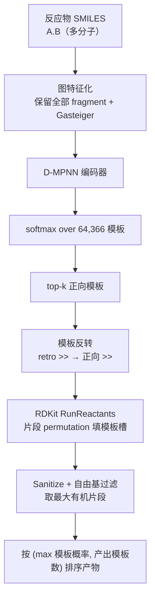
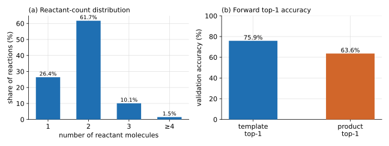
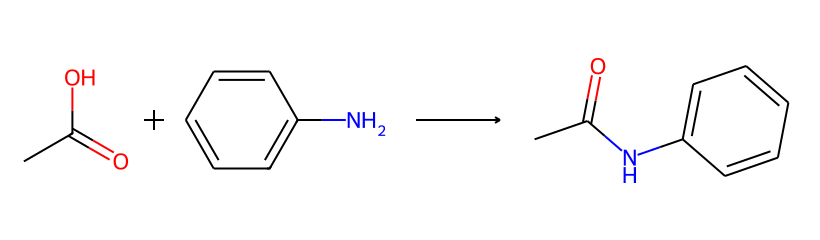

# 单步正向反应预测

**任务**：给定一组反应物（reactants），预测最可能的产物（product）并排序。

SynOmega 的正向预测是逆合成单步模型的**镜像**：复用同一套 64,366 个反应模板与同一个
D-MPNN 模板分类器，只是在应用阶段把逆合成模板**反转**后用 RDKit 正向施加到反应物上。
它是模板法（template-based），可解释、与逆合成共享模板库；不追求 SOTA 端到端精度。

## 1. 模型 / 算法架构



**编码器 D-MPNN**（`ForwardTemplateGNN`，与逆合成共用权重）：`hidden_dim=300`、
`depth=3`、`dropout=0.1`、读出 `sum`；模板分类头 `head_hidden=600`、`head_dropout=0.2`，
softmax 到 64,366 类；反应中心头 `center_head_hidden=128`（加载但**正向排序不使用**）。

与逆合成特征化的唯一区别：正向输入是**多反应物集合**，因此 `_graph` **不做**
largest-fragment 裁剪——保留全部反应物 fragment（否则会丢掉第二个反应物），
并计算 Gasteiger 电荷。这一点由特征化开关 `TGNN_KEEP_ALL_FRAGS=1` 在训练侧保证，
与推理侧一致。

**模板反转与正向应用**（`apply_template_forward`）：逆合成模板写作 `product >> reactants`，
按 `>>` 拆分后重组为 `reactants >> product` 即得正向反应；正向反应物侧允许多个模板槽。
把反应物拆成 fragment，用 `permutations` 枚举 fragment 到模板槽的有序指派，
`RunReactants(..., maxProducts=1000)` 生成候选产物。

!!! warning "自由基 / 卡宾伪影过滤"
    radius-0 模板正向施加时，RDKit 对**欠价**原子会补充自由基电子（例如
    `[C]=O` 价 3），生成化学上不合理的卡宾/酰基自由基产物，而 RDKit 只拒**过价**、
    不拒欠价。因此对每个产物强制 `num_radical_electrons == 0` 过滤，再取最大有机
    片段、清 atom map、canonical 化，得到与真实产物同形式的 SMILES。

## 2. 伪代码

```text
function forward_predict(reactants_smiles, top_k=10, topk_templates=10):
    g = graph_featurize(reactants_smiles)      # 保留全部 fragment + Gasteiger
    logits = DMPNN(g)                          # 忽略 center head
    probs  = softmax(logits)
    top_labels, top_probs = topk(probs, topk_templates)

    best = {}                                  # product -> [max_prob, n_templates, template_id]
    for (label, prob) in zip(top_labels, top_probs):
        retro_smarts = template_library[label]
        for product in apply_template_forward(retro_smarts, reactants_smiles):
            if product not in best:
                best[product] = [prob, 1, label]
            else:
                if prob > best[product][0]:
                    best[product][0] = prob
                    best[product][2] = label
                best[product][1] += 1          # 有多少个模板能产出该产物
    ranked = sort(best.items(), key = (-max_prob, -n_templates))
    return [ForwardPrediction(product, score=max_prob, template_id) for ... in ranked[:top_k]]

function apply_template_forward(retro_smarts, reactants_smiles):
    fwd_rxn = invert(retro_smarts)             # "L>>R" -> "R>>L"，剥一层外括号
    frags = fragments(reactants_smiles)
    if len(frags) == 0 or len(frags) > 8: return []      # 病态输入守卫
    nslots = fwd_rxn.num_reactant_templates
    if len(frags) < nslots: return []
    outcomes = []
    for assignment in permutations(frags, nslots):       # 枚举片段→模板槽
        for product in RunReactants(assignment, maxProducts=1000):
            sanitize(product)
            if any_radical(product): continue            # 剔卡宾/自由基伪影
            outcomes.append(canonical_largest(product))
            if len(outcomes) >= 64: return dedup(outcomes)
    return dedup(outcomes)
```

**排序直觉**：一个产物继承"产出它的所有模板里的最大概率"；概率相同的产物，
按"有多少个模板能产出它"降序（越多模板支持越靠前）。

## 3. 训练集

- 来源：与逆合成同一份原子映射反应语料，radius-0 / min-count 20，**64,366 模板类**。
- 规模：语料 **15,809,108** 条反应；正向任务实际可用约 **13–14M** 训练 /
  **~790K** 验证 / **~790K** 测试。
- 划分：按反应 id `% 20`——`0 → test`、`1 → val`、其余 `→ train`（与逆合成同约定）。
- 反应物分子数分布（见下图）：单反应物 26.4%、双 61.7%、三 10.1%、≥4 为 1.5%；
  **多分子（≥2）反应占 73.6%**——这正是"保留全部 fragment"必须的原因。

训练超参：`batch_size=256`、`epochs=50`、AdamW、`lr=1e-3`、`weight_decay=1e-5`、
`warmup_steps=2000`、cosine、`label_smoothing=0.1`、`grad_clip=5`、混合精度、`seed=42`；
反应中心头 BCE、`center_pos_weight=25`。

{ loading=lazy }

## 4. 评测指标

在验证集上（`id%20==1`）：

| 指标 | 数值 |
|---|---|
| 模板 template top-1 | **0.759** |
| 产物 product top-1 | **0.636** |

产物 top-1 低于模板 top-1，是模板法的结构性上限所致：即便命中正确模板，把它正向施加
到反应物上不一定唯一复现真实产物（区域/位点多解）。

!!! note "只报有据可查的数字"
    验证集 top-5 / top-10、center F1、self-recovery 等指标本仓未落盘结果文件，故此处
    **不列**，以免出现无出处的数字。软件测试对产物 top-1 设有回归下限断言
    （`product_top1 ≥ 0.55`）。

**演示预测**：一组 8 个例子里 top-1 命中 6、未中 2；两个未中都发生在单反应物输入上
（模型选错了切断位点）。下图是"酰胺偶联"的正向示意——羧酸 + 胺 → 酰胺：

{ loading=lazy }

## 5. 局限与定位

- 精度上限受"模板可正向复现产物"限制，非端到端 SOTA；价值在于**与逆合成共享模板、
  可解释、零额外训练**（复用同一 checkpoint）。
- 跨分子的消息传递在 v1 未显式建模（分类头靠 sum 读出联合看到全部反应物）；
  长尾 logit 调整、虚拟全局节点等为后续方向。
