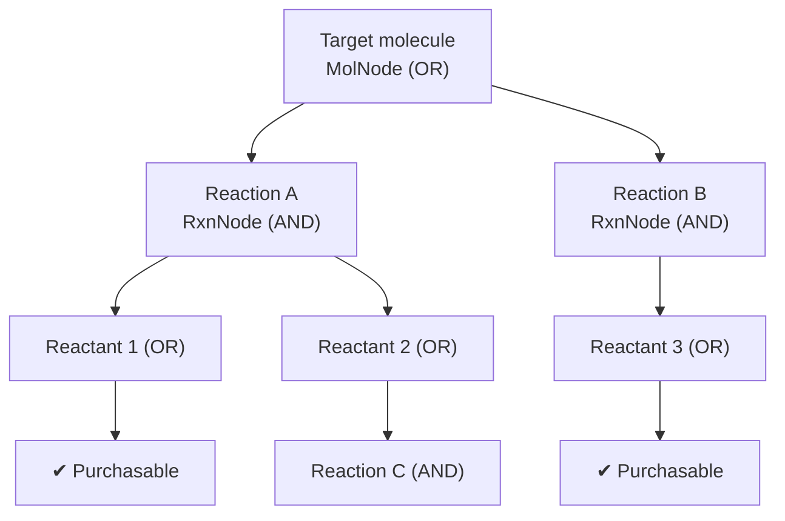

# Multi-step Route Planning

**Task**: Repeatedly expand single-step retrosynthesis until every leaf is a purchasable
building block, thereby producing a complete synthetic route to the target molecule. SynOmega
searches over a single **AND-OR graph**; the default algorithm is **Retro\*** (Chen et al., ICML 2020),
with MCTS and best-first offered as two interchangeable alternatives.

## 1. Search graph: the AND-OR graph



- **MolNode (OR node)**: a molecule; its multiple candidate reactions stand in an "or"
  relation — solving any one of them solves the molecule. A molecule is solved iff `in_stock`
  or **any** child reaction is solved.
- **RxnNode (AND node)**: a reaction; its reactants stand in an "and" relation — it is solved
  only when **all** reactants are solved. Its cost is `cost = -log(max(score, 1e-12))`, which
  makes cost additive along a route.
- **DAG rather than tree**: molecule nodes are interned by **InChIKey**, so a given molecule is
  unique in the graph and is naturally deduplicated; `add_reaction` performs cycle detection
  (rejecting a reactant that is an ancestor, avoiding X ← X); `propagate_solved` propagates
  the solved state bottom-up by iteration (not recursion) to prevent stack overflow.

## 2. Default algorithm: Retro\*

Retro\* is a best-first AND-OR search equipped with a value function. It maintains a
**cost-to-go** estimate for each molecule and preferentially expands the "most promising"
frontier nodes:

- \( r_n(m) = 0 \) (purchasable); \( = V(m) \) (unexpanded, using the heuristic estimate);
  \( = \min_r \big[\, \mathrm{cost}(r) + \sum_{c} r_n(c) \,\big] \) (expanded).
- The **global** cost of reaching a molecule is \( V(m) = r_n(m) + \delta(m) \), where \( \delta(m) \)
  is the cost of "the rest of the tree that must be paid for in order to reach m" (recursing
  toward the root, including the sum of sibling \(r_n\)).

```text
function retrostar(target, budget, expansion_width=50):
    graph = AndOrGraph(target)
    while not graph.root.solved and not budget.exhausted(expansions):
        frontier = select_frontier(graph)           # unsolved/unexpanded nodes, take a batch by ascending V
        if frontier is empty: break
        preds = model.predict_batch(frontier_smiles, expansion_width)
        for node, pred_list in zip(frontier, preds):
            node.expanded = True; expansions += 1
            attach_reactions(graph, node, pred_list) # create RxnNodes; mark purchasable children solved
        refresh(graph)                               # fixed-point iteration: recompute all r_n until stable
    return SearchResult(solved=graph.root.solved, graph, stats)
```

`refresh` is a bottom-up fixed-point iteration (at most 64 rounds) — because the search graph
is small, recomputing everything from scratch is cheaper than a single model call, so no
incremental optimization was done.

### value function (supplies the heuristic \(V\))

| Name | \(V(m)\) | Purpose |
|---|---|---|
| `MolSizeValue` (default) | `scale·max(0, heavy_atom_count − free_atoms)` | Larger molecules are farther from purchasable |
| `ZeroValue` | 0 (admissible) | Retro\* degenerates to uniform-cost |
| `ConstantValue` | fixed penalty per unsolved molecule | Prefers fewer unsolved molecules |

## 3. Interchangeable algorithms: MCTS and best-first

- **MCTS** (`mcts`, Segler 2018 / AiZynthFinder style): selection (UCT descent, skipping dead
  nodes) → expansion + rollout (greedy playout, `rollout_depth=3`) → backpropagation. The
  **reward is the fraction of purchasable molecules in the final frontier** (partial credit,
  better than 0/1). `exploration=1.4`, `expansion_width=25`.
- **best-first** (`bfs`): a `g+h` priority queue (heapq), where `g` approximates cumulative
  reaction cost and `h` comes from the value function; with `ZeroValue` it is uniform-cost,
  and with a heuristic it approximates A\*. Serves as a reference implementation.

The top-level `Planner` is assembled in the order **base model → (optional plausibility filter)
→ (optional cache) → search algorithm** (the filter sits inside the cache, so the cache already
holds filtered expansions); `Budget(max_depth=6, time_limit=60, max_expansions=500)` is the
default budget, tightened to a unified operating point for evaluation (see the [overview](index.md)).

## 4. Evaluation results

On the 1000-target ChEMBL set, under aligned budgets (k=10), we compare the **original model**
against the **simplification-constrained model** (see the [retro chapter](retro.md)).

### 4.1 Expansion-width sweep (k = 3…10)

{ loading=lazy }

Key points: the solved rate of the simplification-constrained model climbs to **85.1%** at k=10,
and at k≈8 it **overtakes** the expensive reference of "the original model @ k=50" (83.9%); the
original model plateaus at roughly 81.8%. The curves flatten around k≈6–8, and we select k=10
as the operating point.

### 4.2 Efficiency gain from the simplification constraint (k=10)

{ loading=lazy }

| Comparison | Original | Simplified | Change |
|---|---|---|---|
| solved rate (1000 targets) | 81.8% | **85.1%** | +3.3 pp (McNemar p=1.5e-3) |
| mean expansions (all) | 38.8 | **32.0** | **−18%** |
| mean expansions (783 jointly-solved targets) | 22.0 | **15.7** | ≈ **−30%** (Wilcoxon W=20881, p=8.6e-21) |
| median search time | 0.49 s | **0.32 s** | about one-third less |

That is: without any loss of coverage, the simplification constraint lowers the expansion cost
of multi-step search by about 18% (nearly 30% on jointly-solved targets). This is a
**search-efficiency gain**, NOT a "simpler = more reasonable" claim.

### 4.3 Comparison with AiZynthFinder

{ loading=lazy }

On the same 1000 ChEMBL, the same ZINC building-block set, aligned budgets (top-10 expansion,
depth 5, 100 iterations), and the same GPU:

| System | Search algorithm | solved | median search time |
|---|---|---|---|
| SynOmega (simplified) | Retro\* | **85.1%** | ~0.3 s |
| SynOmega (original) | Retro\* | 81.8% | ~0.5 s |
| AiZynthFinder v4.4.1 | MCTS | **46.7%** (467/1000) | 4.1 s |

SynOmega achieves roughly **1.8× the solved rate** of AiZynthFinder; 391 targets are solved
only by SynOmega and 7 only by AiZynthFinder; the median search time of the simplified model
is about **1/13** that of AiZynthFinder.

## 5. Limitations

- Retro\*'s `refresh` recomputes the whole graph, which is not optimal on very large search
  graphs (not a bottleneck at the current scale).
- The solved rate depends on building-block coverage and the recall of the single-step model;
  out-of-distribution and very large / multi-component targets remain difficult.
