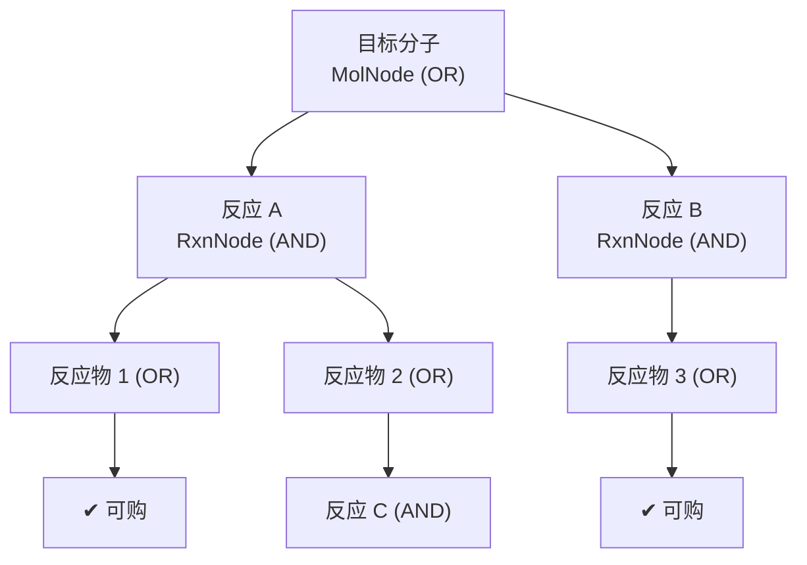
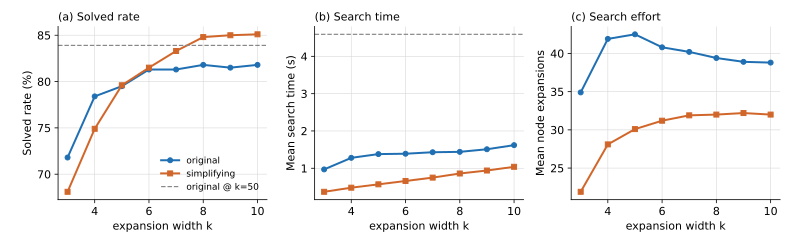
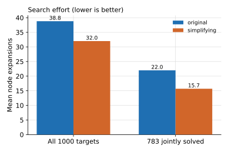
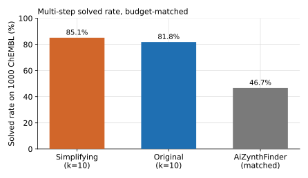

# 多步反应路径规划

**任务**：把单步逆合成反复展开，直到所有叶子都是可购砌块，从而给出目标分子的完整合成
路径。SynOmega 在一张 **AND-OR 图**上搜索，默认算法是 **Retro\***（Chen et al., ICML 2020），
另提供 MCTS 与 best-first 两种可替换算法。

## 1. 搜索图：AND-OR 图



- **MolNode（OR 节点）**：一个分子，多个候选反应是"或"关系——任一反应解出即解出。
  `in_stock` 或**任一**子反应 solved ⇒ 该分子 solved。
- **RxnNode（AND 节点）**：一个反应，其反应物是"与"关系——**所有**反应物 solved 才 solved。
  成本 `cost = -log(max(score, 1e-12))`，使成本沿路径可加。
- **DAG 而非树**：分子节点按 **InChIKey** interning，同一分子在图中唯一，天然去重；
  `add_reaction` 做环检测（反应物若是祖先则拒绝，避免 X ← X）；`propagate_solved`
  用迭代（非递归）自底向上上推求解状态，防栈溢出。

## 2. 默认算法：Retro\*

Retro\* 是一种带 value function 的 best-first AND-OR 搜索。它维护每个分子的
**cost-to-go** 估计并优先扩展"最有希望"的前沿节点：

- \( r_n(m) = 0 \)（可购）；\( = V(m) \)（未扩展，用启发估计）；
  \( = \min_r \big[\, \mathrm{cost}(r) + \sum_{c} r_n(c) \,\big] \)（已扩展）。
- 到达某分子的**全局**代价 \( V(m) = r_n(m) + \delta(m) \)，其中 \( \delta(m) \) 是
  "为到达 m 而必须支付的、树其余部分"的代价（向 root 递归，含兄弟节点 \(r_n\) 之和）。

```text
function retrostar(target, budget, expansion_width=50):
    graph = AndOrGraph(target)
    while not graph.root.solved and not budget.exhausted(expansions):
        frontier = select_frontier(graph)           # 未解/未扩展节点，按 V 升序取 batch
        if frontier is empty: break
        preds = model.predict_batch(frontier_smiles, expansion_width)
        for node, pred_list in zip(frontier, preds):
            node.expanded = True; expansions += 1
            attach_reactions(graph, node, pred_list) # 建 RxnNode，可购子标 solved
        refresh(graph)                               # 定点迭代重算所有 r_n 直到不变
    return SearchResult(solved=graph.root.solved, graph, stats)
```

`refresh` 是自底向上的定点迭代（最多 64 轮）——因搜索图小，整体重算比一次模型调用还便宜，
故未做增量优化。

### value function（提供启发 \(V\)）

| 名称 | \(V(m)\) | 用途 |
|---|---|---|
| `MolSizeValue`（默认） | `scale·max(0, 重原子数 − free_atoms)` | 分子越大离可购越远 |
| `ZeroValue` | 0（admissible） | Retro\* 退化为 uniform-cost |
| `ConstantValue` | 每未解分子固定罚值 | 偏好更少未解分子 |

## 3. 可替换算法：MCTS 与 best-first

- **MCTS**（`mcts`，Segler 2018 / AiZynthFinder 风格）：选择（UCT 下降，跳过死节点）→
  扩展 + rollout（贪心 playout，`rollout_depth=3`）→ 回传。**reward = 最终前沿中可购分子的
  比例**（部分信用，优于 0/1）。`exploration=1.4`、`expansion_width=25`。
- **best-first**（`bfs`）：`g+h` 优先队列（heapq），`g` 近似为累计反应成本、`h` 来自 value
  function；`ZeroValue` 时为 uniform-cost，有启发时近似 A\*。作为参考实现。

顶层 `Planner` 按 **base 模型 →（可选合理性过滤）→（可选缓存）→ 搜索算法**的顺序组装
（过滤器在缓存之内，缓存的已是筛过的扩展）；`Budget(max_depth=6, time_limit=60, max_expansions=500)`
为默认预算，评测时收紧到统一操作点（见[总览](index.md)）。

## 4. 评测结果

在 1000 ChEMBL 靶集、预算对齐（k=10）下，比较**原始模型**与**简化约束模型**（见[逆向章](retro.md)）。

### 4.1 扩展宽度扫描（k = 3…10）

{ loading=lazy }

要点：简化模型的 solved rate 随 k 攀升到 **85.1%**（k=10），在 k≈8 处**超过**"原始模型
@ k=50"这一昂贵参考（83.9%）；原始模型在 ~81.8% 处基本平台化。曲线在 k≈6–8 趋平，
选定操作点 **k=10**。

### 4.2 简化约束的效率增量（k=10）

{ loading=lazy }

| 对比 | 原始 | 简化 | 变化 |
|---|---|---|---|
| solved rate（1000 靶） | 81.8% | **85.1%** | +3.3 pp（McNemar p=1.5e-3） |
| 平均扩展（全体） | 38.8 | **32.0** | **−18%** |
| 平均扩展（783 共解靶） | 22.0 | **15.7** | ≈ **−30%**（Wilcoxon W=20881, p=8.6e-21） |
| 中位搜索时间 | 0.49 s | **0.32 s** | 约减少三分之一 |

即：简化约束在**不损覆盖率**的前提下，把多步搜索的扩展代价降了约 18%（共解靶上近 30%）。
这是**搜索效率增量**，而非"更简单 = 更合理"。

### 4.3 与 AiZynthFinder 对照

{ loading=lazy }

同一 1000 ChEMBL、同一 ZINC 砌块集、预算对齐（top-10 扩展、深度 5、100 次迭代）、
同一 GPU 上：

| 系统 | 搜索算法 | solved | 中位搜索时间 |
|---|---|---|---|
| SynOmega（简化） | Retro\* | **85.1%** | ~0.3 s |
| SynOmega（原始） | Retro\* | 81.8% | ~0.5 s |
| AiZynthFinder v4.4.1 | MCTS | **46.7%**（467/1000） | 4.1 s |

SynOmega 约为 AiZynthFinder 的 **1.8× solved rate**；仅 SynOmega 解出 391 个、仅
AiZynthFinder 解出 7 个；简化模型的中位搜索时间约为 AiZynthFinder 的 **1/13**。

## 5. 局限

- Retro\* 的 `refresh` 是全图重算，超大搜索图上非最优（当前规模下不构成瓶颈）。
- solved rate 依赖砌块集覆盖与单步模型召回；分布外、超大/多组分目标仍是难点。
