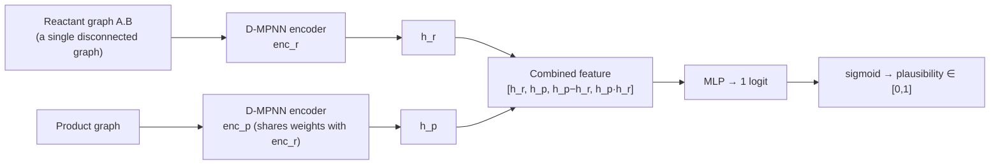

# Reaction Plausibility Scoring

**Task**: given a reaction (reactants + product), output a plausibility score in \([0,1]\) —
how chemically likely it is to actually occur. Its purpose is to judge "how trustworthy is this
step" for single-step retrosynthesis candidates.

This is a binary classifier: positives = high-yield real reactions; negatives = "superficially
plausible but never actually happened" wrong products generated by templates on the same
reactants.

## 1. Model / algorithm architecture (shipped model: dual-tower D-MPNN)

The plausibility model shipped with SynOmega is **`DualPlausibilityNet`** (checkpoint
`plaus_dual-best.pt`) — a **dual-tower, atom-mapping-free** architecture:



- The two towers (`enc_r`, `enc_p`) independently encode the **reactant graph** and the
  **product graph** (no CGR, no atom mapping); when `shared=True` they share a single set of
  D-MPNN weights.
- The combined feature **`[h_r, h_p, h_p−h_r, h_p·h_r]`** (4×hidden) is fed to the head
  `Linear(4h → 300) → ReLU → Dropout → Linear(→1)`, which outputs a single logit turned into a
  score by sigmoid.
- Hyperparameters: `hidden_dim=300`, `depth=4`, `dropout=0.1`, `head_hidden=300`. The scorer
  `PlausibilityScorer` loads this checkpoint, applies an LRU cache over graphs, and scores in
  batches of `batch_size`.

!!! note "There is also a research variant"
    The research repo `reaction-plausibility/` additionally contains a **CGR (Condensed Graph
    of Reaction) + D-MPNN single-graph variant (`plaus_full`)**: it superimposes the reactant
    and product graphs into one, encodes the "change", and uses MCS to find atom correspondence.
    It is **not** the shipped model; this page treats the dual-tower shipped model as
    authoritative, and both share the training-data pipeline described below.

## 2. Pseudocode

```text
function score_reaction(reactants_smiles, product_smiles):
    g_r = mol_to_graph(reactants_smiles)   # "A.B" as a single disconnected graph; ignore atom map
    g_p = mol_to_graph(product_smiles)
    if g_r is None or g_p is None: return 0.0
    h_r = DMPNN_enc(g_r);  h_p = DMPNN_enc(g_p)
    feat = concat(h_r, h_p, h_p - h_r, h_p * h_r)
    return sigmoid(head(feat))              # ∈ [0,1]
```

## 3. Training data

- **Positives**: reactions in the condition-annotated corpus with **yield > 95%** (100k seeds taken by
  default) — high yield ≈ genuinely occurred.
- **Negatives** (template-generated hard negatives, not randomly swapped products):
    - *Same template*: take the seed's own radius-0 template, run it forward on its reactants,
      and any product ≠ the true product becomes a negative (≤ 3 per seed).
    - *Different template*: run **other** templates on the seed's reactants (pool = 64,366
      templates), and products ≠ the true product become negatives (≤ 5 per seed).
- **Two data-quality fixes** (otherwise the classifier learns shortcuts):
    1. A "negative" differing only in stereochemistry is actually a diastereomer of the true
       product → strip stereochemistry from **all** positives and negatives.
    2. Low-specificity templates such as deprotection would treat a leaving group / by-product
       as the "product" → keep only generated products whose heavy-atom count falls within
       **[0.6, 3.0]×** of the true product.
- Split: a deterministic split by hashing the seed id ≈ **90/5/5** (positives and negatives of
  the same seed go into the same split to prevent leakage); negative:positive ≈ 4–5×, and
  training uses a weighted BCE with `pos_weight=4`. The absolute sample counts per split were
  not persisted in this repo.

Training hyperparameters: `batch_size=256`, `epochs=40`, AdamW, `lr=5e-4`, `weight_decay=1e-5`,
`grad_clip=5`, mixed precision, early stopping on val AUC (patience=6).

## 4. Evaluation: strong on the training axis, net-negative on the usage axis

**Training/validation axis**: the model reaches **val AUC = 0.9946** on the validation set —
strong discriminative power on the training axis of "fix the reactants, judge whether the
product is right or wrong".

**But using it to filter single-step retrosynthesis candidates is a net-negative.** Across 998
targets, after deleting single-step candidates by plausibility score (delete only, no
re-ranking), the top-1…top-10 hit rates **all decrease slightly** (−0.2 ~ −0.9 pp):

| Configuration | top-1 | top-3 | top-5 | top-10 |
|---|---|---|---|---|
| No filter | 0.3798 | 0.5471 | 0.6112 | 0.6764 |
| Threshold 0.3 | 0.3758 | 0.5461 | 0.6062 | 0.6713 |
| Threshold 0.4 | 0.3758 | 0.5451 | 0.6052 | 0.6713 |
| Threshold 0.5 | 0.3778 | 0.5411 | 0.6022 | 0.6683 |

Discriminative power is weak on the usage axis — the median plausibility of correct vs. wrong
candidates is only **0.995 vs 0.973**, with heavily overlapping distributions:

{ loading=lazy }

**Root cause**: the training axis (fix reactants, swap product) and the usage axis (fix product,
swap reactants) are **orthogonal**. The biases the model learns on the training axis (e.g.
penalizing real reactions with "a reactant leaving", OOD on large / multi-component molecules)
cause it to wrongly delete true candidates on the usage axis.

!!! warning "Hence off by default"
    Based on the above evaluation, single-step plausibility filtering is **off by default** in
    SynOmega; the feature is retained and can be explicitly enabled
    (`Planner(..., plausibility=...)`). Under multi-step planning the filter does not change the
    solved rate (23/25), but makes the median search time about **3.3×** slower — further
    support for keeping it off by default.

## 5. Limitations

- Template negatives are inherently hard negatives, and the size-band filter cannot remove all
  legitimate alternative products (regioisomerism, genuine side reactions).
- What is needed is a discriminator that "fixes the product and judges whether the reactant set
  is feasible"; the current model's training axis does not match this, and the direction for
  improvement is to reconstruct the negatives and training objective along the usage axis.
