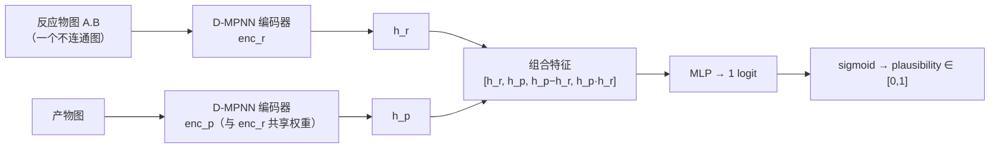
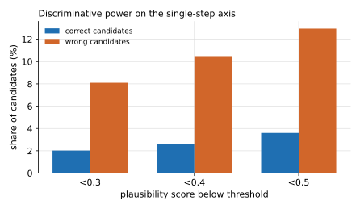

# 反应合理性评分

**任务**：给定一个反应（反应物 + 产物），输出一个 \([0,1]\) 的合理性分数——它在化学上有多
可能真实发生。用途是给单步逆合成的候选做"这一步靠不靠谱"的判别。

这是一个二分类模型：正样本 = 高产率的真实反应，负样本 = 在同一反应物上用模板生成的
"表面合理但没真发生"的错误产物。

## 1. 模型 / 算法架构（发货版：双塔 D-MPNN）

SynOmega 随包发货的合理性模型是 **`DualPlausibilityNet`**（checkpoint `plaus_dual-best.pt`）——
一个**双塔（dual-tower）、无原子映射**的结构：



- 两座塔（`enc_r`、`enc_p`）分别独立编码**反应物图**与**产物图**（无 CGR、无原子映射），
  `shared=True` 时共享同一套 D-MPNN 权重。
- 组合特征 **`[h_r, h_p, h_p−h_r, h_p·h_r]`**（4×hidden），交给 head
  `Linear(4h → 300) → ReLU → Dropout → Linear(→1)` 输出单 logit，sigmoid 成分数。
- 超参：`hidden_dim=300`、`depth=4`、`dropout=0.1`、`head_hidden=300`；打分器
  `PlausibilityScorer` 加载该 checkpoint，对图做 LRU 缓存后按 `batch_size` 批量打分。

!!! note "另有一个研究变体"
    研究仓 `reaction-plausibility/` 里还有一个 **CGR（反应缩合图）+ D-MPNN 单图变体
    （`plaus_full`）**：把反应物图与产物图叠成一张、编码"变化"，用 MCS 求原子对应。它**不是**
    发货版；本页以双塔发货版为准，两者共用下述训练数据管线。

## 2. 伪代码

```text
function score_reaction(reactants_smiles, product_smiles):
    g_r = mol_to_graph(reactants_smiles)   # "A.B" 作为一个不连通图；忽略 atom map
    g_p = mol_to_graph(product_smiles)
    if g_r is None or g_p is None: return 0.0
    h_r = DMPNN_enc(g_r);  h_p = DMPNN_enc(g_p)
    feat = concat(h_r, h_p, h_p - h_r, h_p * h_r)
    return sigmoid(head(feat))              # ∈ [0,1]
```

## 3. 训练数据

- **正样本**：条件语料中 **yield > 95%** 的反应（默认取 10 万个 seed）——高产率≈确有发生。
- **负样本**（模板生成的 hard negative，而非随机换产物）：
    - *同模板*：取 seed 自身的 radius-0 模板，在其反应物上正向运行，任何 ≠ 真产物的产物
      即负样本（每 seed ≤ 3）。
    - *异模板*：在 seed 反应物上运行**其它**模板（池 = 64,366 个模板），产物 ≠ 真产物者
      为负样本（每 seed ≤ 5）。
- **两个数据质量修复**（否则分类器会学到捷径）：
    1. 只差立体化学的"负样本"其实是真产物的非对映体 → 对正负样本**一律剥离立体化学**。
    2. 脱保护等低特异性模板会把离去基团/副产物当"产物" → 只保留重原子数落在真产物
       **[0.6, 3.0]×** 区间的生成产物。
- 划分：按 seed id 哈希确定性切分 ≈ **90/5/5**（同一 seed 的正负样本进同一 split，防泄漏）；
  负:正 ≈ 4–5×，训练用 `pos_weight=4` 的加权 BCE。各 split 绝对样本量本仓未落盘。

训练超参：`batch_size=256`、`epochs=40`、AdamW、`lr=5e-4`、`weight_decay=1e-5`、
`grad_clip=5`、混合精度、按 val AUC early stop（patience=6）。

## 4. 评测：训练轴强，使用轴净负

**训练/验证轴**：模型在验证集上 **val AUC = 0.9946**——在"固定反应物、判断产物对错"这个
训练轴上判别力很强。

**但用于单步逆合成候选过滤是净负收益。** 在 998 个靶点上，用合理性分数删除（只删不重排）
单步候选后，top-1…top-10 命中率**全部小幅下降**（−0.2 ~ −0.9 pp）：

| 配置 | top-1 | top-3 | top-5 | top-10 |
|---|---|---|---|---|
| 无过滤 | 0.3798 | 0.5471 | 0.6112 | 0.6764 |
| 阈值 0.3 | 0.3758 | 0.5461 | 0.6062 | 0.6713 |
| 阈值 0.4 | 0.3758 | 0.5451 | 0.6052 | 0.6713 |
| 阈值 0.5 | 0.3778 | 0.5411 | 0.6022 | 0.6683 |

判别力在使用轴上很弱——正确候选 vs 错误候选的合理性中位数仅 **0.995 vs 0.973**，
分布高度重叠：

{ loading=lazy }

**根因**：训练轴（固定反应物、换产物）与使用轴（固定产物、换反应物）**正交**。模型在训练轴
学到的偏置（如惩罚"有反应物离去"的真实反应、对大分子/多组分 OOD）在使用轴上会误删真候选。

!!! warning "因此默认关闭"
    基于以上评测，单步合理性过滤在 SynOmega 中**默认关闭**，功能保留、可显式开启
    （`Planner(..., plausibility=...)`）。多步规划下过滤不改变解出率（23/25），但中位搜索
    时间约 **3.3×** 变慢——进一步支持默认关闭。

## 5. 局限

- 模板负样本本质是 hard negative，size-band 过滤无法剔除全部合法替代产物（区域异构、真实
  副反应）。
- 需要的是"固定产物、判断反应物集是否可行"的判别器；当前模型训练轴与之不匹配，改进方向是
  按使用轴重构负样本与训练目标。
