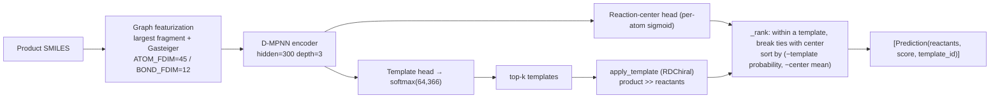
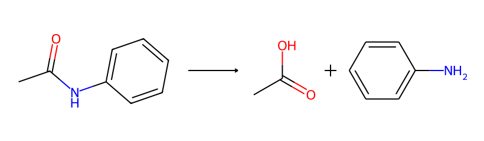

# Single-step Retrosynthesis Prediction

**Task**: given a product SMILES, predict which reactant sets a one-step reaction can
break it into, and rank them. This is the atomic operation of the whole multi-step
planning process—`predict(smiles, top_k) -> [Prediction]`.

The core is **neural template classification**: a D-MPNN reads the product molecular
graph, applies softmax over 64,366 reaction templates, takes the top-k templates, and uses
RDChiral to apply each template back onto the product, yielding candidate reactant sets.
If torch is not installed, it degrades to a pure template-rule backend (ranked by template
prior).

## 1. Model / algorithm architecture



**D-MPNN (directed bond message passing, Yang et al. 2019)**. The key is that messages
are passed centered on **directed bonds**, and the reverse edge is subtracted during
aggregation to prevent information from flowing back along the same bond:

- Edge initialization: \( h^0_{ij} = \mathrm{ReLU}(W_\text{in}[x_i \,\|\, e_{ij}]) \)
- Iterate `depth−1` times: \( m_{ij} = \big(\textstyle\sum_{k} h_{ki}\big) - h_{ji} \),
  \( h_{ij} = \mathrm{ReLU}(h^0_{ij} + W_\text{hid}\, m_{ij}) \)
- Atom aggregation: \( h_i = \mathrm{ReLU}(W_\text{out}[x_i \,\|\, \textstyle\sum_k h_{ki}]) \)
- Graph readout `sum` → template logits; plus per-atom reaction-center logits

**Role of the reaction-center head** (a key design): the center probability is used to
break ties **only within the same template probability** (i.e., among different
substructure matches of the same template), thereby improving top-1 while **not losing**
top-K coverage—it does not participate in cross-template reranking.

Feature dimensions `ATOM_FDIM=45` / `BOND_FDIM=12` (atomic-number one-hot, degree, formal
charge, chirality, hydrogen count, hybridization, aromatic/ring, mass, electronegativity,
Gasteiger charge, etc.), with a per-position dimension guard on the checkpoint at load
time (`W_input.weight` width must equal `ATOM_FDIM+BOND_FDIM`).

## 2. Pseudocode

```text
function retro_predict(product_smiles, top_k=50, topk_templates=50):
    g = graph_featurize(largest_fragment(product_smiles))    # + Gasteiger
    tpl_logits, center_logits = DMPNN(g)                     # center is optional
    probs  = softmax(tpl_logits)
    center = sigmoid(center_logits)                          # per-atom
    top_labels, top_probs = topk(probs, topk_templates)

    cand = {}                          # reactants(tuple) -> (tpl_prob, center_avg, label)
    for (label, prob) in zip(top_labels, top_probs):
        smarts = template_library[label]                     # product >> reactants
        for outcome in apply_template(smarts, product_smiles):
            c = mean(center[a] for a in outcome.match_atoms) if center else 0
            key = outcome.reactants
            cand[key] = max(cand.get(key), (prob, c, label))  # keep the better score for identical reactants
    ranked = sort(cand, key = (-tpl_prob, -center_avg))
    return [Prediction(reactants, score=tpl_prob, template_id) for ... in ranked[:top_k]]
```

`apply_template` (RDChiral style): the template's reactant pattern is the product
pattern, and `RunReactants((product,))` generates each outcome; matched atoms are assigned
to an outcome only when the number of substructure matches aligns with the number of
outcomes (used for center averaging); each product undergoes `SanitizeMol`, atom-map
clearing, and canonicalization, any failure discards the whole outcome, and results are
returned after deduplication (default `max_outcomes=64`).

## 3. Simplification-constrained model

A **parallel** single-step variant: it **restricts the action space to "simplifying"
templates**—writing the retro direction, the product is a single molecule and the
reactants are two or more molecules (i.e., every step breaks the target into smaller
precursors). This is a **data-layer** constraint (the model can only emit simplifying
disconnections), not an inference-time reranking.

{ loading=lazy }

- Of the 64,366 templates, **42,028 (65.3%)** are simplifying, forming the label space of the constrained model.
- The constrained model is warm-started from the **encoder and reaction-center head** of
  the original model, reinitializing only the template classification head (the label
  space differs).
- **Positioning (honest)**: the simplification constraint delivers a **multi-step
  search-efficiency gain** (fewer expansions, faster, no drop in solve rate, see
  [Multi-step planning](planning.md)), **NOT** a "simpler = more reasonable" plausibility
  novelty.

## 4. Training set and evaluation

For the training corpus and template extraction, see the [Overview](index.md).

| Model | Evaluation convention | top-1 | top-10 |
|---|---|---|---|
| Original model (r20, 64,366 classes) | Independent val/test split | **0.403** | **0.742** |
| Simplification-constrained model (42,028 classes) | held-out | **0.575** | — (not reported in the paper) |

!!! note "The two top-1 values are not directly comparable"
    The simplification model has a smaller label space and a more constrained task, so its
    top-1 is naturally higher; because the two label spaces differ, **the numbers cannot
    be compared directly**. The original model's numbers come from the model training
    records, and the simplification model's numbers come from the paper's main text.

Architecture and training hyperparameters (identical for both models, excerpt): D-MPNN
`hidden=300 / depth=3 / dropout=0.1`, template head `head_hidden=600`, center head
`hidden=128`; AdamW, `lr=1e-3`, `weight_decay=1e-5`, cosine + 2000 warmup,
`label_smoothing=0.1`, `grad_clip=5`, mixed precision; templates applied via RDChiral.

## 5. Limitations

- The template method can only reproduce reaction types seen in the corpus; long-tail
  templates have sparse samples, so recall of rare reactions is limited.
- top-k coverage is limited by the granularity of the template library; radius-0 templates
  have weak control over site/stereo (affecting both plausibility and forward
  reproduction, see the corresponding chapters).
