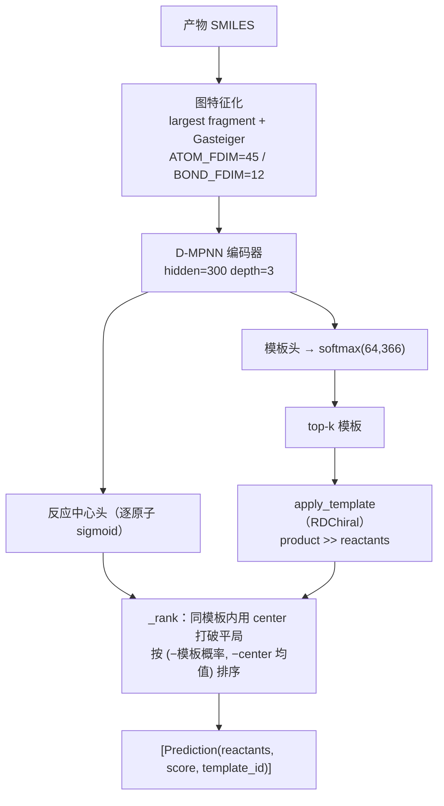

# 单步逆向反应预测

**任务**：给定一个产物 SMILES，预测一步反应能把它拆成哪些反应物集合，并排序。这是整个
多步规划的原子操作——`predict(smiles, top_k) -> [Prediction]`。

内核是**神经模板分类**：D-MPNN 读产物分子图，softmax 到 64,366 个反应模板上，取 top-k
模板后用 RDChiral 把每个模板施加回产物，得到候选反应物集合。若不装 torch，可退化为纯模板
规则后端（按模板先验排序）。

## 1. 模型 / 算法架构



**D-MPNN（有向键消息传递，Yang et al. 2019）**。关键在于消息以**有向键**为中心传递，
并在聚合时减去反向边，避免信息沿同一条键回流：

- 边初始：\( h^0_{ij} = \mathrm{ReLU}(W_\text{in}[x_i \,\|\, e_{ij}]) \)
- 迭代 `depth−1` 次：\( m_{ij} = \big(\textstyle\sum_{k} h_{ki}\big) - h_{ji} \)，
  \( h_{ij} = \mathrm{ReLU}(h^0_{ij} + W_\text{hid}\, m_{ij}) \)
- 原子聚合：\( h_i = \mathrm{ReLU}(W_\text{out}[x_i \,\|\, \textstyle\sum_k h_{ki}]) \)
- 图读出 `sum` → 模板 logits；另有逐原子反应中心 logits

**反应中心头的作用**（关键设计）：center 概率**只在同一模板概率内部**用于打破平局
（即同一模板的不同子结构匹配之间），从而提升 top-1，而**不损失** top-K 覆盖——它不参与
跨模板的重排。

特征维度 `ATOM_FDIM=45` / `BOND_FDIM=12`（原子序数 one-hot、度、形式电荷、手性、
氢数、杂化、芳香/环、质量、电负性、Gasteiger 电荷等），加载时对 checkpoint 做
逐位维度守卫（`W_input.weight` 宽度须等于 `ATOM_FDIM+BOND_FDIM`）。

## 2. 伪代码

```text
function retro_predict(product_smiles, top_k=50, topk_templates=50):
    g = graph_featurize(largest_fragment(product_smiles))    # + Gasteiger
    tpl_logits, center_logits = DMPNN(g)                     # center 可选
    probs  = softmax(tpl_logits)
    center = sigmoid(center_logits)                          # 逐原子
    top_labels, top_probs = topk(probs, topk_templates)

    cand = {}                          # reactants(tuple) -> (tpl_prob, center_avg, label)
    for (label, prob) in zip(top_labels, top_probs):
        smarts = template_library[label]                     # product >> reactants
        for outcome in apply_template(smarts, product_smiles):
            c = mean(center[a] for a in outcome.match_atoms) if center else 0
            key = outcome.reactants
            cand[key] = max(cand.get(key), (prob, c, label))  # 同反应物取更优
    ranked = sort(cand, key = (-tpl_prob, -center_avg))
    return [Prediction(reactants, score=tpl_prob, template_id) for ... in ranked[:top_k]]
```

`apply_template`（RDChiral 风格）：模板反应物模式即产物模式，`RunReactants((product,))`
生成各 outcome；仅当子结构匹配数与 outcome 数对齐时才把匹配原子归到 outcome（用于
center 平均），逐产物 `SanitizeMol`、清 atom map、canonical 化，任一失败整体丢弃，
去重后返回（默认 `max_outcomes=64`）。

## 3. 简化约束模型（simplification-constrained）

一个**并列的**单步变体：把动作空间**限制在"简化型"模板**上——逆写下产物为单分子、
反应物为两个及以上分子（即每一步都把目标拆成更小的前体）。这是**数据层**约束
（模型只可能吐出简化型拆断），而非推理时重排。

{ loading=lazy }

- 64,366 个模板中 **42,028 个（65.3%）** 为简化型，构成约束模型的标签空间。
- 约束模型从原始模型的**编码器与反应中心头热启动**，仅重初始化模板分类头（标签空间不同）。
- **定位（诚实）**：简化约束带来的是**多步搜索效率增量**（更少扩展、更快、solve 不降，
  见[多步规划](planning.md)），**不是**"更简单 = 更合理"的合理性新颖性。

## 4. 训练集与评测

训练语料、模板抽取见[总览](index.md)。

| 模型 | 评测口径 | top-1 | top-10 |
|---|---|---|---|
| 原始模型（r20，64,366 类） | 独立 val/test 切分 | **0.403** | **0.742** |
| 简化约束模型（42,028 类） | held-out | **0.575** | —（论文未列） |

!!! note "两个 top-1 不可直接比较"
    简化模型的标签空间更小、任务更受限，top-1 天然更高；两者标签空间不同，**数值不可直接
    横比**。原始模型数字来自模型训练记录，简化模型数字来自论文正文。

架构与训练超参（两模型一致，节选）：D-MPNN `hidden=300 / depth=3 / dropout=0.1`、
模板头 `head_hidden=600`、中心头 `hidden=128`；AdamW、`lr=1e-3`、`weight_decay=1e-5`、
cosine + 2000 warmup、`label_smoothing=0.1`、`grad_clip=5`、混合精度；模板经 RDChiral 应用。

## 5. 局限

- 模板法只能复现语料里见过的反应类型；长尾模板样本稀疏，罕见反应召回受限。
- top-k 覆盖受模板库粒度限制；radius-0 模板对位点/立体的控制较弱（对合理性与正向复现均有
  影响，见对应章）。
