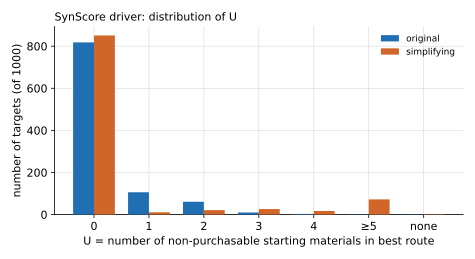
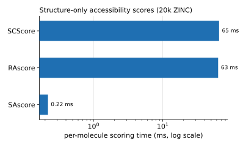

# Synthesizability Scoring: SynScore

**Task**: assign a target molecule a **synthesizability score** in \([0,1]\) — how easily it can
be synthesized from purchasable starting materials. Unlike structure-only heuristic scores
(SAscore/SCScore/RAscore), SynScore actually **runs a multi-step route search** once and scores
by "how many non-purchasable starting materials the best route still lacks", making it
interpretable, rankable, and route-grounded.

## 1. Definition

Let \(U\) be the number of **non-purchasable starting materials** in the best route; then

\[
\mathrm{SynScore} = \frac{1}{(U+1)^{U}}
\]

| \(U\) | 0 | 1 | 2 | 3 | 4 | ≥5 | No route |
|---|---|---|---|---|---|---|---|
| SynScore | 1.0 | 0.5 | ≈0.111 | ≈0.016 | ≈0.0016 | ≤1e-3 | 0 |

- \(U=0\) (all leaves purchasable, depth ≤5) is called **solved** and earns the full score of 1.
- The score **decays super-linearly** with \(U\) — separating more steeply than a linear
  coverage measure such as "fraction of purchasable leaves", so that molecules closer to being
  fully solvable are pulled further apart.
- Choice of the **best route**: when solved, take the solution with the **fewest reaction
  steps**; when unsolved, fall back to the partial route with the smallest \(U\) (then coverage,
  then step count), to carry a "near-miss" signal.

The companion continuous metric **bb_coverage** (fraction of purchasable leaves in the best
route) gives a smoother distribution than the binary solved flag in batch analysis.

## 2. Algorithm and pseudocode

SynScore is driven by `SynthesizabilityScorer`, which runs one planning pass and then aggregates
from the route:

```text
function synscore(smiles, max_steps=5):
    result = planner.plan(smiles, max_depth=max_steps)     # see "Multi-step Route Planning"
    routes = result.routes
    solved = [r for r in routes if r.solved]
    if solved:
        best = argmin(solved, key = r.num_steps)           # the solution with the fewest steps
        coverage = 1.0
    elif routes:
        best = argmin(routes, key = (U(r), -r.bb_coverage, r.num_steps))
        coverage = best.bb_coverage
    else:
        return MoleculeReport(solved=False, bb_coverage=0)  # score recorded as 0

    U = number_of_non_purchasable_leaves(best)
    score = 1 / (U + 1) ** U
    return MoleculeReport(smiles, solved=(U==0), bb_coverage=coverage,
                          min_steps=best.num_steps, score=score, leaves=...)
```

Batch scoring `score_batch` runs **sequentially** (the planner holds the GPU + a shared cache,
which does not lend itself to naive multiprocessing; large-scale runs should shard at the shell
layer), can stream results to disk via a callback, and prints a live solve_rate to stderr. The
aggregated `BatchReport` reports `solve_rate`, `mean_bb_coverage`, a histogram by route depth,
and more.

## 3. Evaluation

### 3.1 U distribution (1000 ChEMBL)

{ loading=lazy }

| U | 0 | 1 | 2 | 3 | 4 | ≥5 | No route |
|---|---|---|---|---|---|---|---|
| Original model | 818 | 106 | 61 | 10 | 3 | 1 | 1 |
| Simplified model | 851 | 11 | 21 | 26 | 17 | 72 | 2 |

When the original model fails to solve, it is usually short by only 1–2 non-purchasable starting
materials (U concentrated at 1–2); the simplified model solves more (851 vs 818), but once it
fails it is often much further off (72 targets with U≥5) — because it forces a disconnection at
every step and cannot reach the "buy it in one step" endgame. These are exactly the two kinds of
"unsolved" that SynScore's super-linear decay is meant to distinguish.

### 3.2 Positioning relative to structure-based baselines

Structure-based synthesizability scores are fast, but give inconsistent judgments even for
molecules that are "obviously purchasable":

{ loading=lazy }

| Score | Range | Median/mean | "Off-ideal" fraction | Per-molecule time |
|---|---|---|---|---|
| SAscore | 1.3–7.2 | median 2.7 | 32% of scores >3 | **0.22 ms** |
| RAscore | 0.001–1.0 | mean 0.91 | 17% of scores <0.9 | **63 ms** |
| SCScore | 1.0–5.0 | median 3.7 | 99% of scores >2 | **65 ms** |

On 20,000 **already-purchasable** ZINC building blocks, none of the three structure-based scores
can give a consistent "trivially obtainable" judgment (each classifies a substantial fraction of
purchasable molecules as relatively hard). SynScore makes the opposite trade-off: it **pays the
cost of one route search** in exchange for a **route-grounded** judgment — expensive, but
interpretable and able to produce a concrete route.

!!! note "Note on scope"
    SynScore is a search-based metric, and its "time" is the multi-step search time (see the
    [planning chapter](planning.md), median ~0.3–0.5 s), which is **not on the same axis** as
    the structure-based scores in the table above, so no same-scale comparison is made; here we
    compare only "whether a consistent judgment can be given for purchasable molecules".

## 4. Limitations

- SynScore's quality is entirely determined by the underlying single-step model and
  building-block coverage: poor model recall or a small building-block set will both underestimate
  synthesizability.
- Each molecule requires one search, so the cost is far higher than structure-based scoring;
  large-scale screening needs sharded parallelism + caching.
- \(U\) only counts "the number of non-purchasable starting materials" and does not distinguish
  how far each of them is from purchasable — a deliberate simplification.
